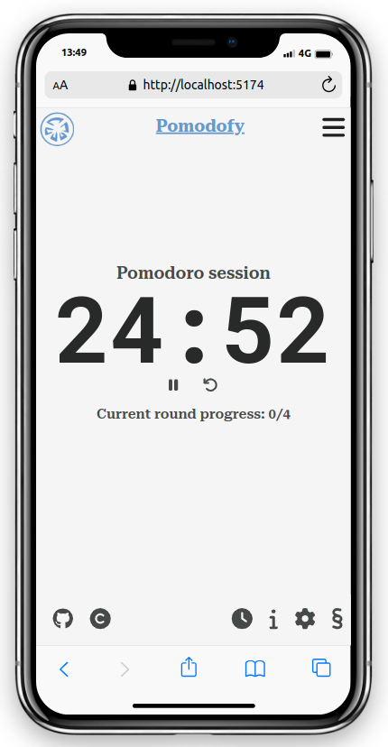

<!-- @format -->

# Pomodofy (Pomodoro Technique Client-side Only SPA)

A Pomodoro technique app built using React, created as the final project for the React module of my Web Dev class at [DCI](https://digitalcareerinstitute.org/courses/web-development/). This app helps you manage your work and breaks effectively, its enterire logic and rendering are handled on the client side.

## Demo

You can check out the live demo of the app [here](https://pomodofy.netlify.app/).

## Acknowledgements

- Pomodoro Technique inspiration from Francesco Cirillo.
- [NoSleep.js](https://github.com/richtr/NoSleep.js)to prevent display from sleeping during pomodoro sessions and breaks.
- Timer sound effects from [pixabay](https://pixabay.com/) and [UNIVERSFIELD](https://pixabay.com/de/users/universfield-28281460/?utm_source=link-attribution&utm_medium=referral&utm_campaign=music&utm_content=123107)

## MVP requirements / detailed functionality

### Design

- Design a responsive layout that supports mobile devices including a hamburger menu.
- Include a page explaining the pomodoro technique and the app
- Include a legal notice (Impressum) page as legally required for German websites.
- Include a footer with links the GitHub repository & developer’s website.
- Place the timer prominently in the main section of the application.

### Timer

- Display the active timer prominently and constantly during active pomodoro sessions and breaks
- Update the timer every second to provide accurate time tracking.
- Provide the ability to start the timer for different phases such as pomodoro, short break, and long break.
- Allow users to pause (and resume) the timer when needed.
- Implement a reset functionality to start the current timer from the beginning.
- Implement the pomodoro logic:
  - A round should start with a pomodoro session
  - Pomodoro session should be followed by a short break
  - When a pomodoro round has been completed, pomodoro session should be followed by a long break.
- Render the currently active phase only.
- Display the current phase (pomodoro session, short break or long break)
- Display the total count of completed pomodoro sessions in the current round.
- Give audio feedback when a timer has finished. Play different sound depending on whether a pomodoro session or a break has been completed.
- Allow users to resume current session (sync timer states with localStorage of the browser)

### Settingsb

- Sync user settings in LocalStorage of the browser for persistent configuration
- Allow users to customize the durations of pomodoro sessions, short breaks, and long breaks.
- Allow users to adjust the sessions per round
- Render an undo button to reset setting to default for each setting that has been customized
- Render an undo button to reset all settings to default when at least one setting has been customized
